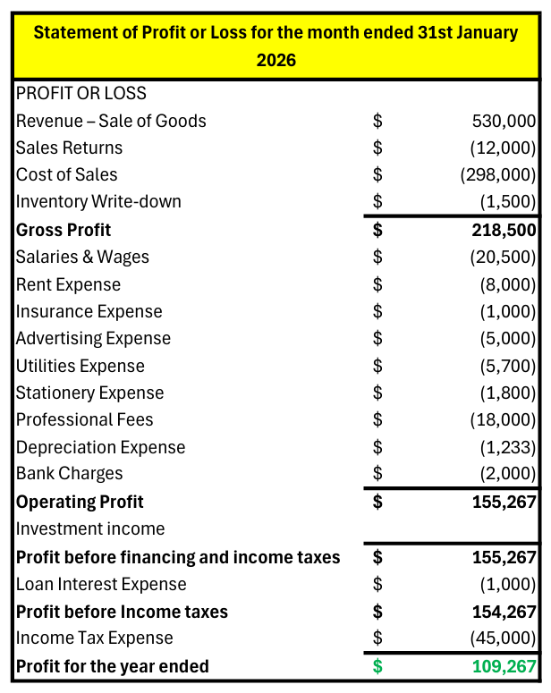
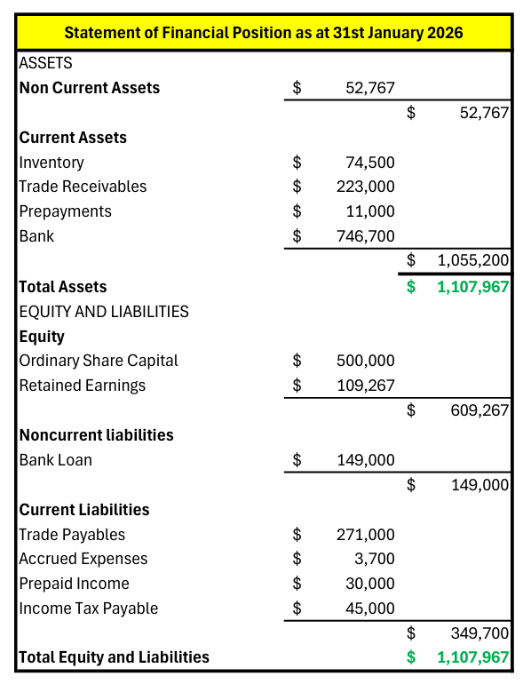
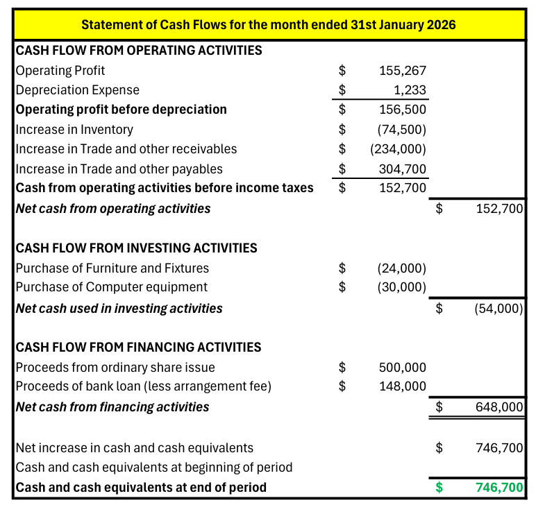
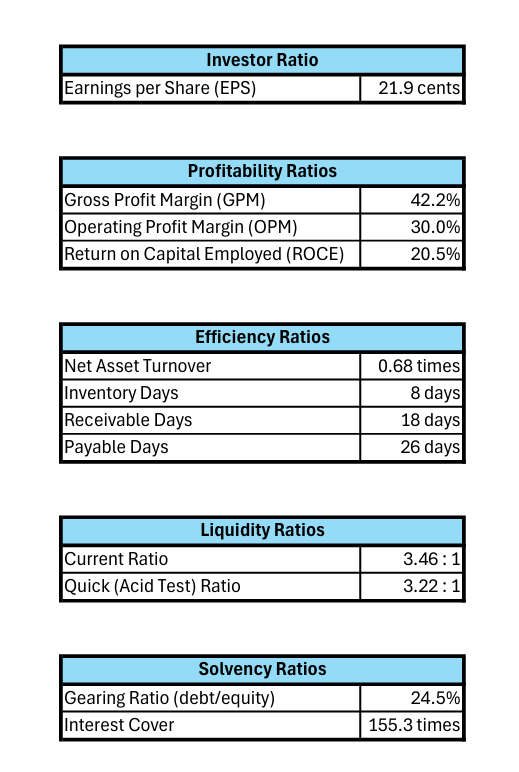

# NorthStar Trading Ltd — End-to-End Bookkeeping & Financial Reporting

An end-to-end simulated bookkeeping and financial reporting project built in **Microsoft Excel** for a fictional UK private company engaged in B2B technology equipment distribution.

The project starts with fictional source transactions and takes them through the complete accounting cycle to **financial statements, closing entries and the post-closing trial balance**.

> **Portfolio project:** This is a fictional educational project and does not represent employment or client work.

---

## Project Overview

| Item                 | Details                                         |
| -------------------- | ----------------------------------------------- |
| Company              | NorthStar Trading Ltd                           |
| Industry             | B2B Technology Equipment Distribution           |
| Legal form           | UK private company                              |
| Accounting framework | IFRS Accounting Standards                       |
| Currency             | USD                                             |
| Accounting period    | January 2026                                    |
| Tool                 | Microsoft Excel                                 |
| Project role         | Junior Financial Accountant — Simulated Project |

---

## Objective

The objective was to build a complete accounting workflow rather than prepare isolated journal entries or financial statements.

### Accounting Workflow

**Source Transactions → General Journal → General Ledger → Adjustments → Adjusted Trial Balance → Financial Statements → Closing Entries → Post-Closing Trial Balance → Ratio Computation**

The complete source transactions, adjustment inputs and project assumptions are documented separately in **[PROJECT_INPUTS.md](PROJECT_INPUTS.md)**.

---

## Key Deliverables

### 1. Statement of Profit or Loss
Summarises the company's revenue, expenses and resulting profit for the period.

### 2. Statement of Financial Position

Presents the company's assets, liabilities and equity at 31 January 2026.

### 3. Statement of Cash Flows

Summarises cash movements during the period across operating, investing and financing activities.

### 4. Ratio Computation

Uses the completed financial statements to calculate key financial ratios.

---

## Accounting Concepts Demonstrated

* Double-entry bookkeeping
* Revenue and sales returns
* Cost of sales
* Trade receivables and payables
* Accruals and prepayments
* PPE and depreciation
* Inventory valuation and NRV/write-down
* Bank financing and interest
* Trial balance preparation
* Financial statement preparation
* Closing procedures
* Financial ratio analysis

---

## IFRS / ACCA Knowledge Applied

* **IAS 2 — Inventories**
* **IAS 16 — Property, Plant and Equipment**
* **IFRS 15 — Revenue / customer advances**
* **IFRS 9 — Financing concepts** *(simplified treatment)*
* **IFRS 18 — Presentation and Disclosure in Financial Statements**

Where treatments have been simplified, the relevant assumptions are documented in **[PROJECT_INPUTS.md](PROJECT_INPUTS.md)**.

---

## Excel Implementation

The workbook demonstrates practical spreadsheet skills alongside accounting knowledge.

### Excel techniques used

* XLOOKUP
* FILTER
* IFERROR
* CHOOSECOLS
* XMATCH
* SUM
* ROUND
* OR
* Structured Excel Tables
* Data Validation
* Linked worksheets
* Formula-driven accounting schedules
* Running balances
* Trial balance controls
* Financial statement linking
* Reconciliation controls

---

## Key Learning Outcome

The main objective of the project was to bridge the gap between **ACCA accounting concepts and practical spreadsheet-based financial reporting**.

Rather than preparing financial statements independently, the workbook links the accounting process from the original transaction data through the ledger, adjustments, trial balance and final reports.

---

## Project Files

| File                                      | Description                                              |
| ----------------------------------------- | -------------------------------------------------------- |
| `northstar_trading_ifrs_bookkeeping.xlsx` | Complete Excel bookkeeping workbook                      |
| `PROJECT_INPUTS.md`                       | Source transactions, adjustments and project assumptions |

---

## Disclaimer

NorthStar Trading Ltd is a **fictional company created for educational and portfolio purposes**.

All transactions, customers, suppliers, balances, assumptions and financial information are fictional.

This project should not be interpreted as professional accounting advice or as evidence of employment/client experience.

---

## Copyright

© 2026 Muhammad Sami. All Rights Reserved.

This project is provided for viewing and educational purposes only. Copying, reproducing, redistributing, modifying, or presenting any part of this work as your own is prohibited without prior permission.
